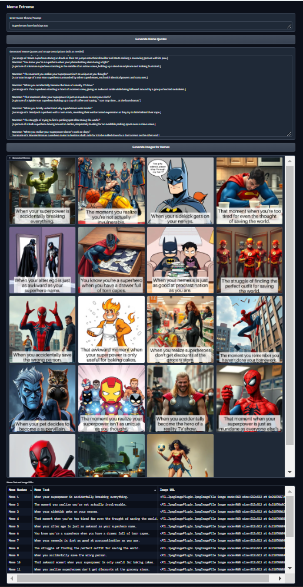
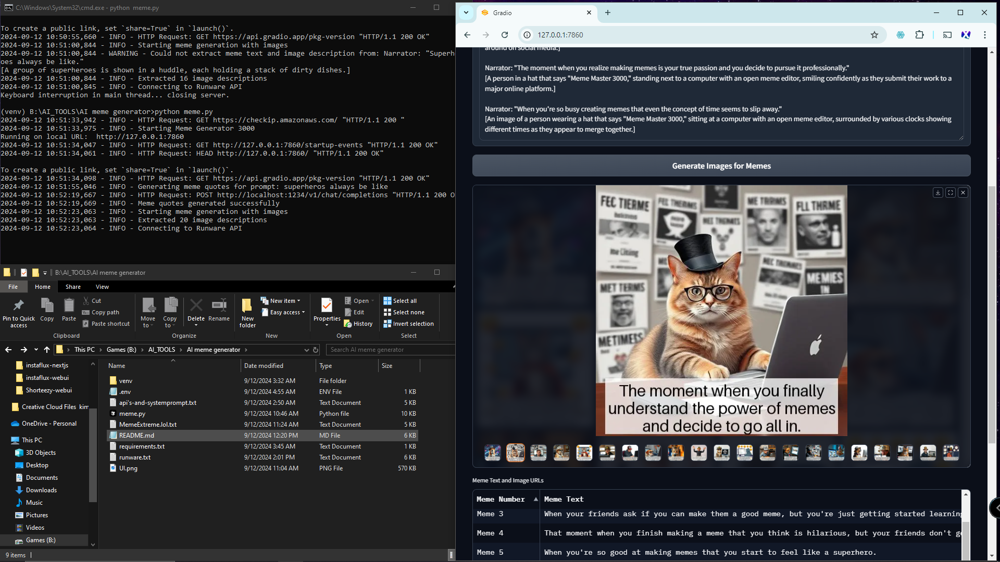

### Meme Extreme


Introducing Meme Extreme, the revolutionary meme generation platform that pushes the boundaries of creativity and speed in the world of viral content creation. This cutting-edge tool combines the power of local language models with advanced image generation technology, allowing users to produce an astounding 20 high-quality, customized memes per minute.

MemeExtreme harnesses the capabilities of LMStudio, a sophisticated local language model, to generate witty and contextually relevant meme and image descriptions based on user-provided themes or prompts. These clever descriptions are then seamlessly integrated with Runware's FastFlux API, an affordable and uncensored image generation service, to produce visually striking and original memes that are sure to captivate audiences.

The user-friendly interface of MemeExtreme enables effortless input of meme themes or prompts, with the local AI API swiftly generating meme and image descriptions. These descriptions are displayed in editable text boxes, allowing users to fine-tune the content before proceeding to image generation. With a simple click of the "Generate Images for Memes" button, users can instantly create 20 finished memes, presented in an attractive gallery format for easy viewing and selection.

MemeExtreme stands out from conventional meme generators by offering unparalleled speed, creativity, and customization options. Its ability to produce a diverse range of memes in rapid succession makes it an invaluable tool for social media influencers, digital marketers, content creators, and meme enthusiasts alike. By leveraging the power of local AI and advanced image generation, MemeExtreme empowers users to stay ahead in the fast-paced world of viral content, ensuring they always have fresh, engaging memes at their fingertips.

Whether you're looking to boost your social media presence, enhance your marketing campaigns, or simply indulge in the joy of meme creation, MemeExtreme is the ultimate solution. Get ready to take your meme game to the extreme and unleash a torrent of laughter and engagement across the digital landscape!
---

# Meme Generator Web UI

This project is a Python-based web application for generating memes using two APIs:
1. **LMStudio API**: Generates meme quotes and image descriptions based on a user-provided prompt.
2. **Runware API**: Generates images based on the image descriptions provided by the LMStudio API.





## Key Features

- **Meme Quote Generation**: Enter a general prompt, and the LMStudio API generates 20 meme quotes with specific image descriptions.
- **Editable Quotes**: Users can edit the generated meme quotes and image descriptions.
- **Image Generation**: Based on the finalized image descriptions, the Runware API generates corresponding images.
- **Meme Display**: The generated memes (text + images) are displayed in a web interface, allowing users to download them.

## Requirements

### 1. LMStudio API
You need to have the **LMStudio** API running locally. The API URL and port should match your local setup. This guide assumes it's available at `http://127.0.0.1:1234`.

### 2. Runware API
The **Runware API** is used to generate images. You need to have an API key for the Runware API. This can be set up in a `.env` file as described below.

## Installation

### 1. Clone the Repository
```bash
git clone https://github.com/yourusername/meme-generator.git
cd meme-generator
```

### 2. Set up a Virtual Environment
It's recommended to use a virtual environment to manage dependencies.

```bash
python3 -m venv venv
source venv/bin/activate  # On Windows: venv\Scripts\activate
```

### 3. Install Dependencies
Install the required Python packages from `requirements.txt`.

```bash
pip install -r requirements.txt
```

### 4. Create a `.env` File
Create a `.env` file in the root directory and add your Runware API key.

```bash
RUNWARE_API_KEY=your_runware_api_key_here
```

### 5. Ensure LMStudio is Running
Make sure your **LMStudio API** is running locally and accessible at `http://127.0.0.1:1234`. You can start it using the instructions from its repository.

## How to Run

### 1. Start the Application
Run the following command to start the Gradio web UI:

```bash
python meme.py
```

### 2. Access the Web UI
Once the application starts, you should see an output indicating that the Gradio web interface is running. Open the provided local URL in your web browser to use the meme generator.

### Example Workflow:

1. **Enter a Meme Theme/Prompt**: Input a general meme prompt like "Monday struggles".
2. **Generate Meme Quotes**: Click the "Generate Meme Quotes" button. 20 meme quotes with corresponding image descriptions will be generated and displayed.
3. **Edit Quotes**: Modify or finalize the meme text and image descriptions.
4. **Generate Images**: Once finalized, click the "Generate Images" button. The Runware API will generate images based on the descriptions, which will then be displayed alongside the meme quotes.

## API Information

### LMStudio API:
- This API is used to generate meme quotes and descriptions.
- You need to have it running locally.
  
### Runware API:
- Generates images based on the image descriptions.
- Requires an API key that you can set in the `.env` file.

## File Structure

```
├── meme.py              # Main Gradio app script
├── requirements.txt    # Dependencies
├── .env                # Contains Runware API key (should be created manually)
└── README.md           # This README file
```

## Requirements

- Python 3.8 or higher
- LMStudio API (local)
- Runware API key

## Dependencies

See `requirements.txt` for the full list of dependencies.

---

### requirements.txt

```txt
gradio==3.17.0
requests==2.31.0
runware==0.1.3
python-dotenv==1.0.0
asyncio==3.4.3
```

### Final Notes
Make sure you have the correct URLs and API keys in place. If you're working in a different environment, you may need to adjust the API URLs in the code.